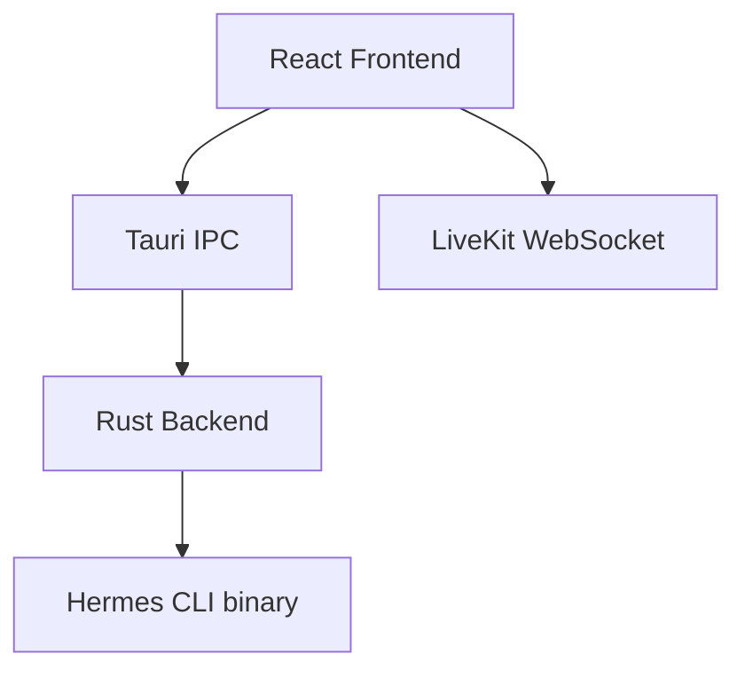

# Architecture Design: Hermes Live Control

## Frozen Architecture Decisions
- **Core:** Hermes CLI
- **Realtime Voice:** LiveKit
- **Frontend:** React, TypeScript, Tailwind, shadcn/ui
- **Desktop:** Tauri v2
- **Communication:** WebSocket (Fallback: SSE)

## System Diagrams

## UI Structure (from Mockups)
- **Minimalist Core:** Dark theme, zero dashboard anxiety. 
- **Header:** Menu + Hermes Title.
- **Body:** Prompt input ("How can I help you today?"), Suggestion Chips.
- **Composer:** Attachment, Text, Microphone, Live Voice toggle.

## Infrastructure
- **Deployment:** Tauri bundler (AppImage/Deb for Linux).
- **Styling:** Tailwind CSS V4 for raw utility + shadcn/ui for accessible base components.
